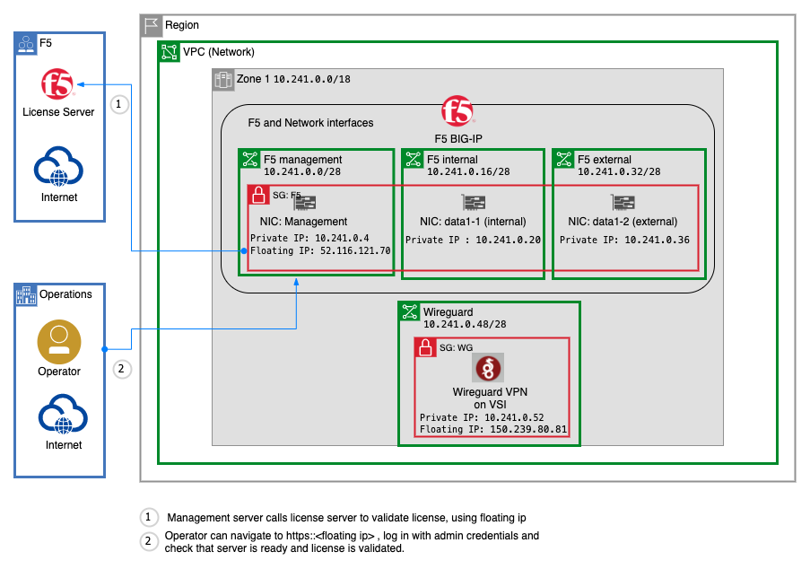
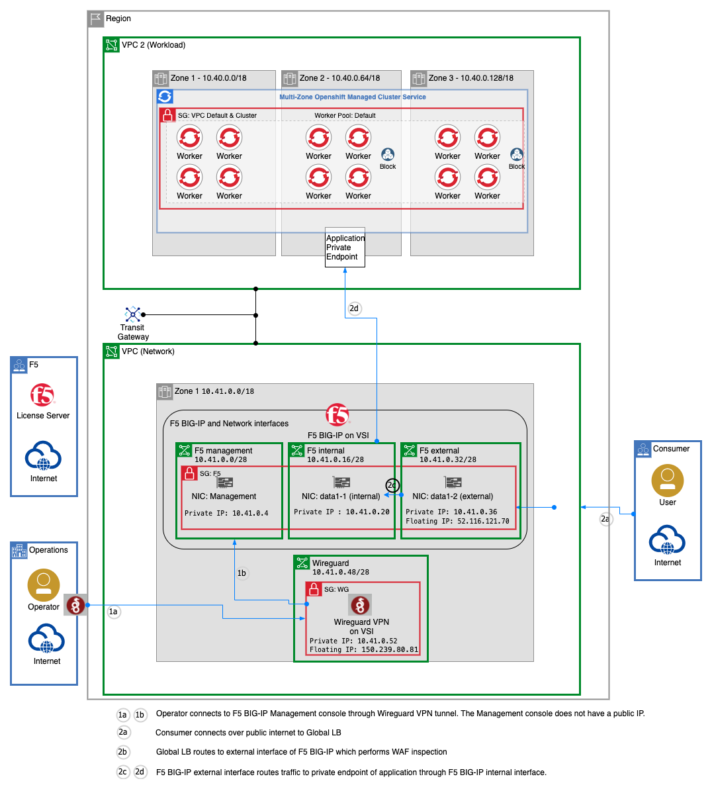

# Install F5 BIG-IP and Optional Wireguard on IBM Cloud

*This is a work-in-progress*

## Introduction

This set of example Terraform scripts demonstrates how to provision a [F5 BIG-IP](https://cloud.ibm.com/catalog/content/ibmcloud_schematics_bigip_multinic_declared-1.0-d33f1544-e938-478a-b0dd-d883370f08d0-global).

* Automate creation of the three subnets required by F5 BIG-IP for each of its network interfaces
* Optionally create a wireguard server for VPN access to the management console
* Provision the F5 BIG-IP

Note that when the F5 BIG-IP is provisioned, a floating-ip will be attached to the management interface in order for it to validate the BYOL license.  After the F5 BIG-IP has finished initializing and validating the license, you then move the floating-ip to the external interface.  Detailed instructions are provided below.


## Prerequisites

* Terraform 0.14 or higher -  see installation instructions in the reference section:  [Terraform installation](#terraform-installation)
* IBM API Key - refer to  [IBM Cloud Doc: Setting up an API key](https://cloud.ibm.com/docs/account?topic=account-userapikey#create_user_key)
* An ssh key object already available in the IBM Cloud in the region where the VSI will be provisioned - refer to [IBM Cloud Doc: Setting up an SSH key](https://cloud.ibm.com/docs/vpc?topic=vpc-ssh-keys).  Once you have the key, you will need to upload it to IBM Cloud.  You can do this in the UI by navigating to `VPC Infrastructure->SSH Keys` and selecting `Create` or, if you have the [IBM Cloud CLI installed](https://cloud.ibm.com/docs/cli?topic=cli-getting-started) with the infrastructure plugin, you can use the command `ibmcloud is key-create` to upload your key.  
* The VPC where you will provision the F5 BIG-IP.  This is typically in a network VPC with other network components.  Make sure that your network VPC uses different address prefixes from the VPC where your workload is running.  
* A BYOL license for the F5 BIG-IP.

*If you plan to use Wireguard to access the Management console*

* WireGuard client installed on your workstation (desktop/laptop) - refer to [WireGuard Documentation: installation](https://www.WireGuard.com/install/)
* Wireguard-tools installed.  This is used to generate public/private keys pairs On [Wireguard Documentation: installation](https://www.WireGuard.com/install/) page, search for `wireguard-tools` for your os.
* A public/private key pair for the wireguard server, and public/private key pairs for at least one client configuration.  To create a pair, use the `wireguard-tools` and run the command `wg genkey | tee privatekey | wg pubkey > publickey`.  The keys can then be copied from the generated privatekey and publickey files.  Alternatively, you can use the helper script by running `../../modules/vsi-ubuntu-wireguard/createkeys.sh -n <numClients>` and this will output the variables `wg_server_config` and `wg_clients` to stdout for you to paste into the `terraform.tfvars` or `variables.tf` file.  If you don't want the server public key or client private keys exposed in the terraform state or output, then remove these from the variables and save them elsewhere to be added to the client configurations manually, later.


## Procedure

You will need to run two terraform scripts.  The first is in the infrastructure folder and the second is in the F5-BIG-IP folder.  This is because the F5 BIG-IP terraform is not designed to be included as a module.

1. Clone this repository
1. Change directories to the `infrastructure` folder
1. Copy the `terraform.tfvars.template` file to `terraform.tfvars` and fill in the variable values.  If you want to provision wireguard, then make sure that the `provision_wireguard` variable is set to `true` and that you have provided values for all of the wireguard variables.  Otherwise, set this variable to `false`.
1. Run `terraform init`
1. Run `terraform apply` and answer `yes` if everything looks good.

You should see output like the following:

```
CLIENT_CONFIGS = "Wireguard not provisioned"
WG_VSI_FLOATING_IP = "Wiregurd not provisioned"
WG_VSI_SUBNET = "Wireguard not provisioned"
f5_external_subnet_id = "0722-7777eee-2222-aaaa-9999-f7babe2211f5"
f5_internal_subnet_id = "0722-0000aaa-4444-2222-8b20-b249e25efa56"
f5_mgmt_subnet_id = "0722-1111ddd-3333-2222-9674-959e5a4eccfc"
```
with the id's of your subnets.  If you chose to provision wireguard, you will also see the details of the Wireguard configuration.

Now you need to provision F5.  Change directories to the F5 folder: `cd ../F5-BIG-IP`.   This script will find the subnet id's created in the previous script by introspecting the terraform state in the infrastructure folder.

1. Start in the `F5-BIG-IP` folder
1. _IMPORTANT:_ Set the `IC_API_KEY` environment variable to your IBM Cloud API Key.  The F5 terraform scripts require this to be set in the environment.  On a mac: `export IC_API_KEY=<ibmcloud_api_key>`
1. Copy the `terraform.tfvars.template` file to `terraform.tfvars` and fill in the variable values.  You will need an F5 BYOL license key and you should make up an admin password.
1. Run `terraform init`
1. Run `terraform apply` and answer `yes` if everything looks good.

You should see output like the following:

```
DEFAULT_GATEWAY = "10.41.0.1"
F5_FLOATNG_MGMT_IP = "52.116.121.70"
F5_INSTANCE_NAME = "test-f5"
F5_INSTANCE_STATUS = "running"
F5_PRIVATE_EXTERNAL_IP = "10.41.0.36"
F5_PRIVATE_INTERNAL_IP = "10.41.0.20"
F5_PRIVATE_MGMT_IP = "10.41.0.4"
SNAT_NEXT_HOP_ADDRESS = "10.41.0.20"
VIRTUAL_SERVER_NEXT_HOP_ADDRESS = "10.41.0.36"
_COMMAND_FLOATING_IP_MOVE = "ibmcloud is floating-ip-update <floating_ip_id> --nic-id 0722-395faaaa-2222-54cc-5555-333e225f1234"
```

When this terraform is complete, this is what has been provisioned.



Notice that the floating ip is on the management interface.  This is required for the F5 can call the license server and validate the license.

You can log into the F5 BIG-IP Management console, by navigating to the floating ip in a browser: `https://<F5_FLOATING_MGMT_IP>` and then provide your credentials `admin:<var.f5_admin_password>` where `.var.f5_admin_password` is the variable you provided.

Wait for the server to be in a ready state.  It may take a while for it to complete it's setup and validate the license.

Once F5 is up, you need to complete the setup by moving the floating_ip to the external interface so that it can receive internet traffic and protect your web application.

1. Find the id of the floating ip that's currently on the management ip.  To find it with the CLI, you can use `ibmcloud is ips | grep <F5_FLOATING_MGMT_IP>` where `F5_FLOATING_MGMT_IP` is the output from running the f5 terraform scripts.   You should get a result like:
```
r014-123456-aaaa-bbbb-a21e-1234567890   52.116.121.70     fmgmt-9999999999999   available   test-f5(management)
```

Substitute the uuid into the `COMMAND_FLOATING_IP_MOVE` output from the terraform output, like this, but with your uuids substituted for the `floating-ip-update` and `nic-id` values.

`ibmcloud is floating-ip-update r014-123456-aaaa-bbbb-a21e-1234567890 --nic-id 0722-395faaaa-2222-54cc-5555-333e225f1234"`

Now you can configure Wireguard for Layer 7 protection of your web application.  You will need to use Wireguard to connect to the management console, or you can use another VPN, bastion server, Direct Link or other private connectivity option.

The following diagram shows the current setup and potential network flows.  The web application could be on RedHat Openshift Kubernetes Services (ROKS) as shown, or hosted on Virtual Server Instances (VSIs) or any combination.




### Future Considerations

For HA, the F5 BIG-IP server should be replicated across three zones, with the Global LB balancing across the three.

The Security Groups and Network ACLs should be further hardened to permit only the desired traffic.

