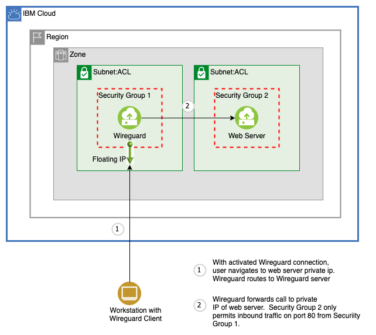
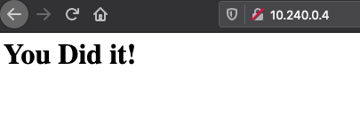

# Install and Configure WireGuard

## Introduction

This set of example Terraform scripts demonstrates how to set up WireGuard VPN to access  private resources on IBM Cloud VPCs from a personal workstation, using the IBM Cloud Provider plug-in. It will

* Create a new resource group into which all resources will be provision.  This will have the name `<basename>-rg`
* provision a VPC instance on IBM Cloud
* provision a ubuntu VSI  on the VPC with a simple web server, secure the VSI with a security group that restricts public access to the VSI; and
* a second VSI with a WireGuard VPN tunnel configured to allow communication over the tunnel from your workstation to private web server endpoint on the ubuntu VSI.

Here is a diagram of the setup:



We will verify that once the WireGuard tunnel is activated,  the web server on the private ubuntu VSI is accessible at `http://<ubuntu_vsi_private_ip>` from the workstation:



### Prerequisites

* Terraform 0.14 or higher -  see installation instructions in the reference section:  [Terraform installation](#terraform-installation)
* IBM API Key - refer to  [IBM Cloud Doc: Setting up an API key](https://cloud.ibm.com/docs/account?topic=account-userapikey#create_user_key)
* An ssh key object already available in the IBM Cloud in the region where the VSI will be provisioned - refer to [IBM Cloud Doc: Setting up an SSH key](https://cloud.ibm.com/docs/vpc?topic=vpc-ssh-keys).  Once you have the key, you will need to upload it to IBM Cloud.  You can do this in the UI by navigating to `VPC Infrastructure->SSH Keys` and selecting `Create` or, if you have the [IBM Cloud CLI installed](https://cloud.ibm.com/docs/cli?topic=cli-getting-started) with the infrastructure plugin, you can use the command `ibmcloud is key-create` to upload your key.  To get the ID to pass into the terraform, use the `UUID` field from the UI, or from the CLI, use the `ID` value for your key, returned from the command `ibmcloud is keys`.
* WireGuard client installed on your workstation (desktop/laptop) - refer to [WireGuard Documentation: installation](https://www.WireGuard.com/install/)
* Wireguard-tools installed.  This is used to generate public/private keys pairs On [Wireguard Documentation: installation](https://www.WireGuard.com/install/) page, search for `wireguard-tools` for your os.
* A public/private key pair for the wireguard server, and public/private key pairs for at least one client configuration.  To create a pair, use the `wireguard-tools` and run the command `wg genkey | tee privatekey | wg pubkey > publickey`.  The keys can then be copied from the generated privatekey and publickey files.


### Input Variables


We recommend using `terraform.tfvars` to provide values to the input parameters to the example scripts, instead of filling them in directly in `variables.tf`. Either copy your existing `terraform.tfvars` into the `examples/WireGuard` directory and edit it to include all the required parameters, or copy from the sample `terraform.tfvars.template` into a new `terraform.tfvars` configuration file and populate it.


| Name | Description | Type | Default/Example | Required |
| ---- | ----------- | ---- | ------- | -------- |
| ibmcloud_api_key | API Key used to provision resources.  Your key must be authorized to perform the actions in this script. | string | N/A | yes |
| basename | prefix used in name of all provisioned resources. | string | "user123" | yes |
| region | Must be the same region as the vpc. | string | "us-south" | yes |
| zone | Zone in which to provision all resources.  Must be in the same region as the vpc. | string | "us-south-1" | yes |
| ssh_key_id | The id of the ssh key that you will use to provision (access) the VSIs | string | N/A | yes |
| wg_cidr | The RFC 4632 CIDR to use for the WireGuard network. | string | "10.0.200.0/24" | yes |
| wg_server_config | The server config for WireGuard. To work properly the private key must be provided | object({ publicKey = string, privateKey = string }) | { publicKey = "", privateKey = "generated via wg command" } | yes |
| wg_clients | The list of client configurations for WireGuard. To work properly the public keys must be provided | list(object({ publicKey = string, privateKey = string })) | [{ publicKey = "generated via wg command", privateKey = "" }] | no |

### Output Variables

| Name | Description |
| ---- | ----------- |
| WEB_SERVER_PRIVATE_IP | The private ip of the Ubuntu VSI created |
| WG_VSI_PRIVATE_IP  | The private ip of the WireGuard VSI created |
| WG_VSI_FLOATING_IP | The floating ip of the WireGuard VSI created |
| WG_VSI_SUBNET      | The cidr of the WireGuard subnet created |
| CLIENT_CONFIGS | The client configuration files needed to connect to the WireGuard server. If complete public/private key pairs were provided these should be complete configs, otherwise they will need to be completed with the appropriate key pair information. |


### Security Considerations

The wireguard VSI is running ubuntu and has disabled PasswordAuthentication over ssh and the root password is deleted.  Addtionally, The security groups on the VSIs do not permit ssh traffic (port 22),  To permit ssh traffic to the wireguard VSI (which has a public floating ip), add a rule to its security group to allow inbound traffic on port 22.  You can further restrict this traffic to your ip only.

In order to provide a deterministic setup, the WireGuard private key of the server and the WireGuard public keys of the clients are provided to the module, and adding/changing them will respin the server with the specified config. However, this also means these values are present within the terraform state and care should be taken to handle them, see [Handling Sensitive Values in State](https://www.terraform.io/docs/extend/best-practices/sensitive-state.html).


## Terraform Version
Tested with Terraform v0.14


## Running the configuration

First, use WireGuard command to generate at least two sets of WireGuard keys,
  * one for the server - the VSI instance, and
  * one for each of the WireGuard clients laptops/workstations

Then run:

```shell
terraform init
```

```shell
terraform apply
```

After you run the script, you should (you may have to wait a few minutes for all the resources to be ready):

* Copy `CLIENT_CONFIGS` info from the script output into a configuration file (e.g. `wg-client.conf`), complete the missing sections, and import into your WireGuard client(s)
* Activate the tunnel by pushing the activate button in the WireGuard client
* Test connectivity to the Ubuntu VSI with accessing the http endpoint `http://<ubuntu_vsi_private_ip>`, either from a browser on your workstation / WireGuard client, or use `curl`. For example:

  ```
  curl http://10.240.0.4
  <html>
    <body><h1>You Did it!</h1></body>
  </html>

  ```


### Terraform installation

* set up a directory to store terraform binary with `mkdir terraform && cd terraform`
* download the `Terraform CLI version 0.14.x` from the [hashicorp site](https://releases.hashicorp.com/terraform/) to the local directory. e.g. `wget https://releases.hashicorp.com/terraform/0.14.8/terraform_0.14.8_linux_amd64.zip`, and unzip it.
* set up the `$PATH` environment variable to point to `terraform` executable: `export PATH=$PATH:$HOME/terraform`
* verify the installation

  ```
  # terraform -version
  Terraform v0.14.8
  ```
